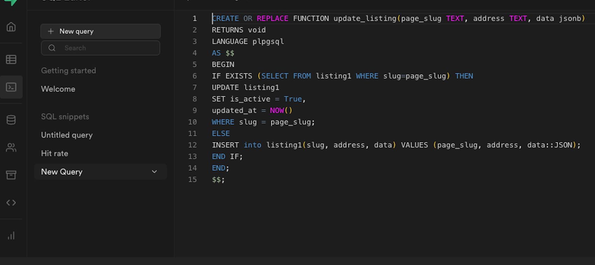
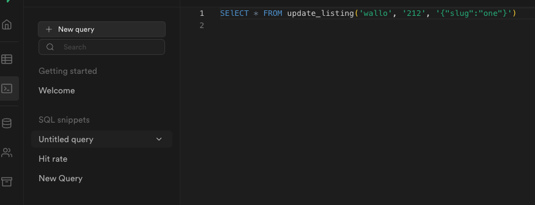

# Supabase update or insert (w/JSON)

## .env.local

```
# Development settings
SUPABASE_URL=
SUPABASE_KEY=

```

## SUPABASE FUNCTION

I was having trouble to find documentation on how to save a JSON with RPC function of Supabase

```
CREATE OR REPLACE FUNCTION update_listing_base(page_slug TEXT, address TEXT, data jsonb)
RETURNS void
LANGUAGE plpgsql
AS $$
BEGIN
IF EXISTS (SELECT FROM listing WHERE slug=page_slug and is_active is True) THEN
UPDATE listing
SET is_active = True,
updated_at = NOW()
WHERE slug = page_slug;
ELSE
INSERT into listing(slug, address, data) VALUES (page_slug, address, data::JSON);
END IF;
END;
$$;
```



And you can run the query in the interface to validate


